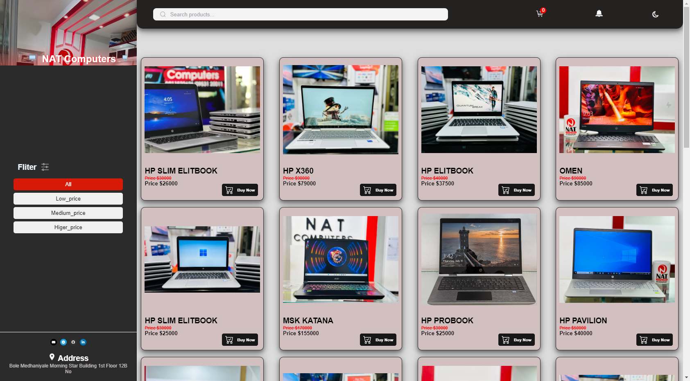
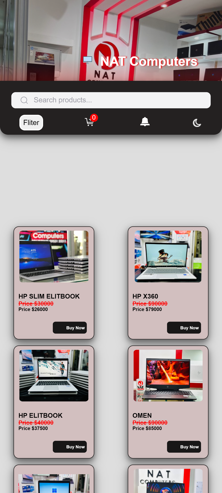

# NAT Computers

NAT Computers is an e-commerce website designed to showcase and sell various computer products. The site includes a product filtering system, a shopping cart, and a payment history section. 

open this link <a href="https://kene19.github.io/computer-shopping/">NAT Computers</a>
## Features

- **Product Listing:** Displays a variety of computer products with details like type, RAM, processor, and price.
- **Filtering:** Users can filter products by price range (Low, Medium, High).
- **Search Functionality:** Allows users to search for products by name.
- **Shopping Cart:** Users can add items to a shopping cart, view the total price, and place orders.
- **Dark/Light Theme Toggle:** Users can switch between dark and light themes, with the preference saved locally.
- **Payment History:** Displays past orders with details like the name of the product, price, payment method, and date.
- **Responsive Design:** The site is optimized for both desktop and mobile devices.

## File Structure

- `index.html`: The main HTML file for the website.
- `css/`: Contains the CSS files for styling the website.
  - `style.css`: General styles for the website.
  - `cart.css`: Styles specific to the shopping cart.
- `js/`: Contains the JavaScript files.
  - `app.js`: Contains the main logic for filtering, search, shopping cart, and theme management.
  - `products.js`: Contains the product data used in the website.
- `photo/`: Contains images used on the website.
  
  ## Features in Detail

 ### Filtering Products
Users can filter the displayed products by selecting one of the following options:

- All: Displays all products.
- Low Price: Displays products in the low price range.
- Medium Price: Displays products in the medium price range.
- Higher Price: Displays products in the high price range.
  
### Shopping Cart

- Add products to your cart by clicking the "Buy Now" button.
- View your cart by clicking on the cart icon.
- Remove items from the cart if needed.
- View the total price of items in the cart, including a 10% delivery fee.
  
### Payment History

- After placing an order, the payment details are saved in the Payment History section.
- You can view previous transactions and clear the history if needed.

### Dark/Light Theme
- Toggle between dark and light themes using the icon at the top.
- Your theme preference is saved locally, so it persists across sessions.

### Technologies Used

- HTML5: For the website structure.
- CSS3: For styling the website.
- JavaScript: For interactivity and logic (filtering, search, cart functionality).
- FontAwesome: For icons.

## images

## License

This project is licensed under the MIT License.
